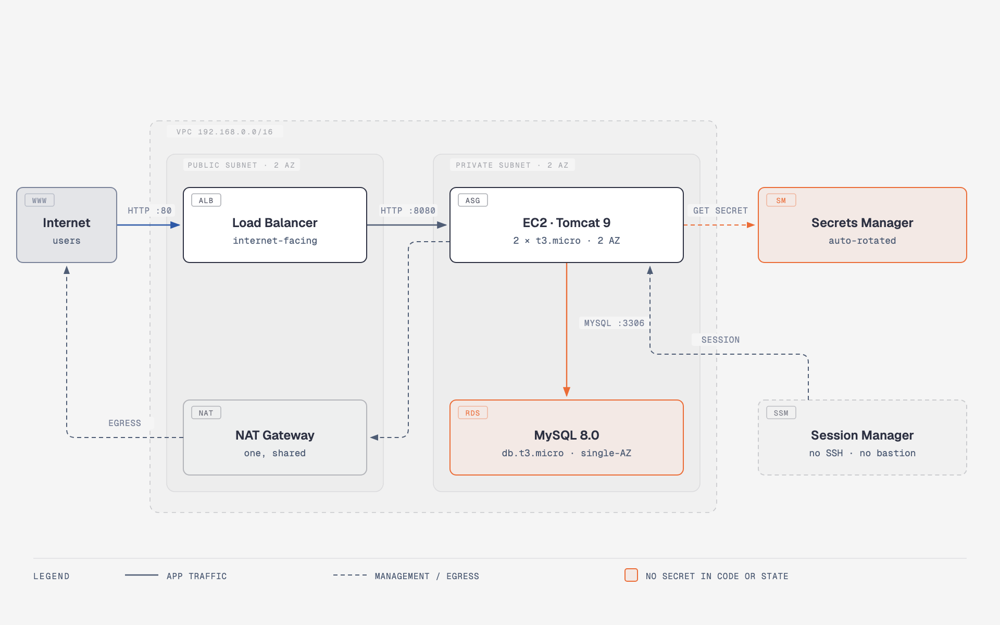
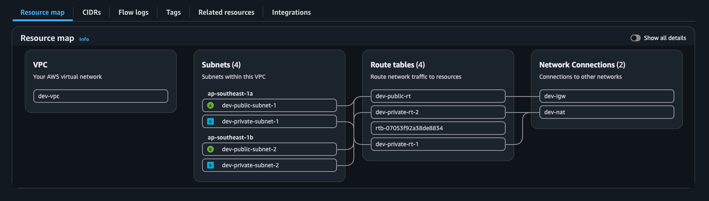
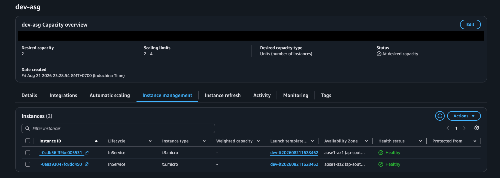

# DevOps Project 01 — Java 3-Tier trên AWS

Ứng dụng Java Spring Boot chạy trên kiến trúc 3 tầng ở AWS, dựng và triển khai
hoàn toàn tự động bằng Terraform, Packer và GitHub Actions.

**Region:** ap-southeast-1 (Singapore)

## Kiến trúc

Ba tầng, mỗi tầng một ranh giới bảo mật:

| Tầng | Thành phần | Vị trí mạng |
| --- | --- | --- |
| Presentation | Application Load Balancer | Public subnet, 2 AZ |
| Application | EC2 trong Auto Scaling Group, Tomcat 9 | Private subnet, 2 AZ |
| Data | RDS MySQL 8.0 | Private subnet, 2 AZ |

Đường duy nhất đi vào từ Internet là ALB. Không có bastion host, không có
security group nào mở port 22. Máy chủ đi ra ngoài qua một NAT Gateway dùng
chung, và quản trị viên vào máy qua SSM Session Manager.

Hai khối màu cam đánh dấu quyết định thiết kế đáng kể nhất: mật khẩu
database do RDS tự sinh và tự xoay vòng trong Secrets Manager, nên không tồn
tại trong source code lẫn trong Terraform state.

*Nguồn sơ đồ: [`docs/architecture.html`](docs/architecture.html) — mở bằng
trình duyệt để xem bản vector.*

## Quyết định thiết kế

**Không có bastion host.** Truy cập máy chủ qua AWS Systems Manager Session
Manager. Không mở port 22 ở bất kỳ security group nào, không quản lý SSH key,
và mọi phiên truy cập được ghi log.

Tôi đã cân nhắc dùng VPC interface endpoint cho SSM rồi loại bỏ: hạ tầng đã có
NAT Gateway nên SSM agent kết nối ra ngoài được rồi. Ba endpoint × 2 AZ tốn
khoảng $0,078/giờ, còn NAT Gateway chỉ $0,059/giờ — cắm thêm endpoint là trả
tiền hai lần cho cùng một đường ra Internet. Endpoint chỉ đáng tiền khi bỏ hẳn
NAT, nhưng khi đó lại phải thêm endpoint cho Secrets Manager và CloudWatch
Logs, tổng còn cao hơn nữa.

**Không có mật khẩu database ở bất kỳ đâu.** RDS bật
`manage_master_user_password`, tự sinh và tự xoay vòng mật khẩu trong Secrets
Manager. Không có biến `db_password` trong Terraform, không có mật khẩu trong
state file, không có gì trong repo.

**Biến `nat_mode`.** Cùng một cấu hình chạy được với `nat_mode = "gateway"`
(NAT Gateway được AWS quản lý sẵn) hoặc `nat_mode = "instance"` (EC2
`t4g.nano` tự cấu hình `iptables MASQUERADE`, rẻ hơn ~7 lần). Đánh đổi: NAT
instance là single point of failure và phải tự vá lỗi hệ điều hành, NAT
Gateway thì không. 🚧 *Bảng so sánh chi phí đo thật từ Cost Explorer sẽ bổ
sung ở Tuần 5*

## Chi phí

Chi phí khi hạ tầng đang chạy, giá ap-southeast-1:

| Thành phần | ~USD/giờ |
| --- | --- |
| Application Load Balancer | 0,025 |
| NAT Gateway | 0,059 |
| RDS db.t3.micro Single-AZ | 0,026 |
| 2× EC2 t3.micro | 0,026 |
| **Tổng** | **≈ 0,14** |

Hạ tầng được `destroy` sau mỗi buổi làm việc, nên chi phí thực tế khoảng
$5/tháng. 🚧 *Số đo thật từ Cost Explorer sẽ bổ sung ở Tuần 5*

## Bằng chứng vận hành

`terraform apply` đã chạy thật trên tài khoản AWS cá nhân (region ap-southeast-1),
tạo đủ 33 resource rồi `destroy` sạch ngay sau khi thu bằng chứng — không có gì
chạy 24/7.

| | |
| --- | --- |
|  |  |
| VPC với 4 subnet trên 2 AZ, 1 NAT Gateway dùng chung | Auto Scaling Group duy trì 2 instance `Healthy`, mỗi instance một AZ khác nhau |

Trong lúc apply, tôi phát hiện tài khoản đang ở Free Tier từ chối
`backup_retention_period = 7` trên RDS (`FreeTierRestrictionError`) — đã sửa về
`0` vì hạ tầng này bị destroy sau mỗi buổi làm việc nên không cần backup.

## Cách chạy

🚧 *Sẽ bổ sung ở Tuần 1*

## Tài liệu

- [Thiết kế hệ thống](docs/superpowers/specs/2026-08-08-devops-project-01-personalization-design.md)
- [Kế hoạch triển khai Tuần 0 + Tuần 1](docs/superpowers/plans/2026-08-08-tuan-0-1-nen-mong-va-terraform.md)
